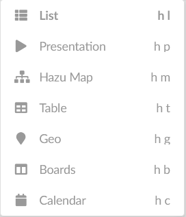

# Modify a page

## What

* You can modify an entry's apperance and behaviour on different places (This entry is a first overview, we will cover this functionality in more detailed patterns.)

## Why

* Make visually appealing pages
* Create propertiers to structure dynamic views like filters or groupings 
* Define application behaviours to honor different use cases and make work more efficient (like default inheritance into a sub hazu)
* Define who can do what in a Hazu site

## How

* These are the places of modification
    * Page Header - the title and some introductionary text. Advanced users can create menus and buttons here.
    * Setting of icons and colors on each entry
    * Setting the view of the page, the most prominent influence on the appearance. 
      
    * Managing Settings
        * Layout - Details of how the page looks like in general (sorting, number of levels etc.)
        * Table and Boards View Settings - Depending on the view, there might be additional individual settings, e.g. grouping
        * Default - how icons and visibilty are to be set in this and the next-level hazus
        * Other settings for different aspects as indicated in the settings menu
    * Managing Sharing options - which roles and users can do what on this page
    * Managing ad-hoc filters - how can we reduce the amount of information in a structured way? Found when using the search function.
* This might be confusing in the beginning. Over time however, it reveals the many options you have to build an attractive, powerful system.
